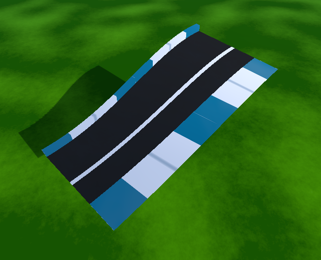
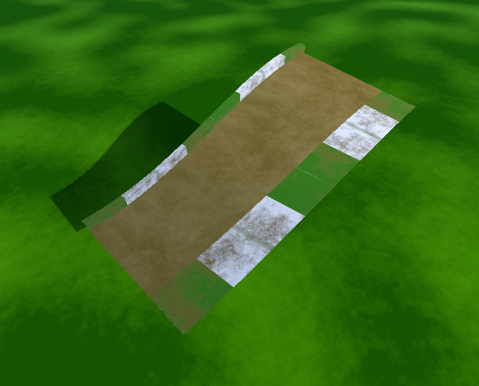
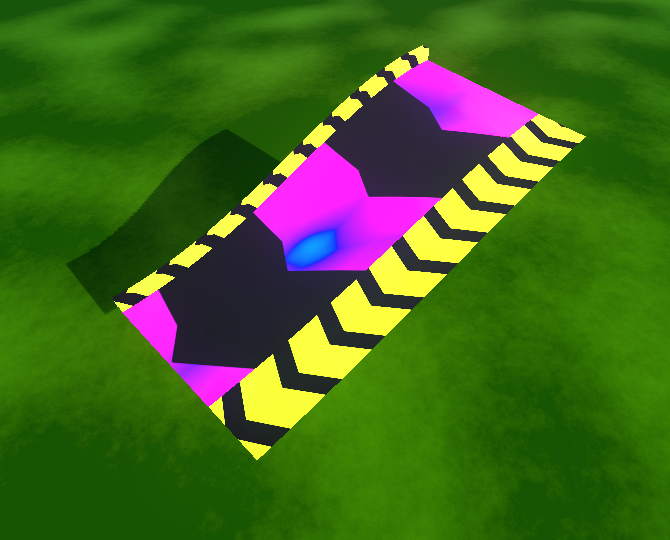
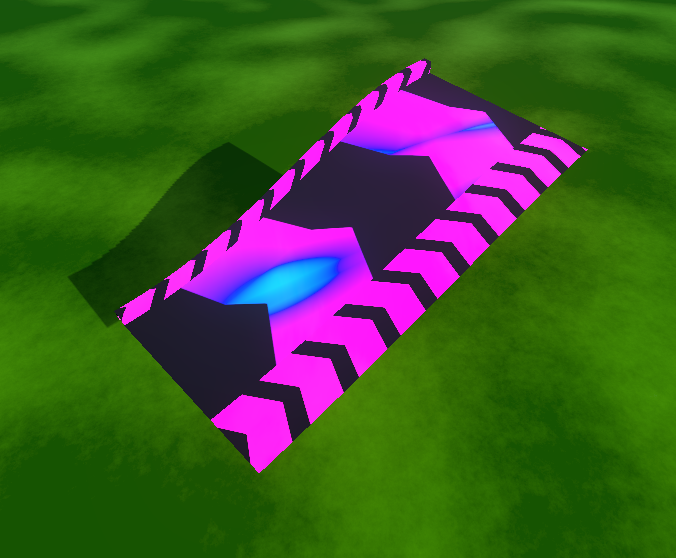
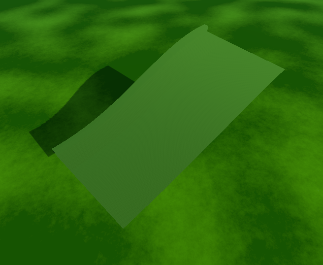
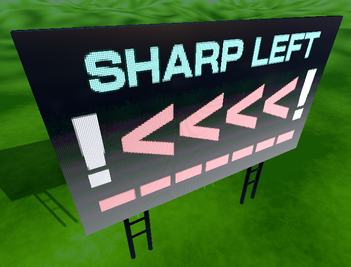

# Editor Guide

up to date as of version v0.28

## Table of Contents

- [Editor Guide](#editor-guide)
	- [Table of Contents](#table-of-contents)
	- [Introduction](#introduction)
		- [Controls](#controls)
	- [Interface](#interface)
		- [Editor Modes](#editor-modes)
		- [Object Properties](#object-properties)
			- [Prefab Properties Sections](#prefab-properties-sections)
			- [Prop Properties](#prop-properties)
		- [Prefab Selector](#prefab-selector)
		- [Shortcut Menu](#shortcut-menu)
		- [Track Properties](#track-properties)
	- [Your First Track](#your-first-track)
		- [Building](#building)
		- [Testing](#testing)
		- [Editing](#editing)
		- [Sharing](#sharing)

  
## Introduction

The editor is a tool that allows you to create and edit tracks. It is a powerful tool that allows you to create tracks of any shape and size, and add a variety of features to them. It is also a tool that requires a lot of practice to master. This guide will help you get started with the editor, and will hopefully help you create some great tracks!

### Controls

**Note:** The editor currently only supports keyboard and mouse controls. Controller support is planned for a future update.

| Key | Action |
| --- | --- |
| `W` `A` `S` `D` | Move camera |
| `MWheel Click` (hold) | Look Around |
| `MWheel` | Move camera up/down |
| `Shift` (hold) | Move camera faster |
| `Left Click` | Place  |
| `Right Click` | Rotate 90° |
| `Shift` + `MWheel` | Rotate fine |
| `Ctrl` + `Z` | Undo |
| `Ctrl` + `Y` | Redo |
| `Ctrl` + `S` | Save |
| `Ctrl` + `1` | Change Editor Mode to `Build` |
| `Ctrl` + `2` | Change Editor Mode to `Edit` |
| `Ctrl` + `3` | Change Editor Mode to `Delete` |
| `Del` | Delete selected object |
| `O`/`P` | Cycle through objects (Track/Start/Checkpoint/Props) |
| `F11` | Toggle fullscreen |
| `Esc` | Pause Menu |

## Interface

When entering the editor, you will be greeted with the following interface:

Let's go over the different parts of the interface:

### Editor Modes

In the top left corner, you will see the editor modes. 

There are 3 different modes:

- **Build**: This is the default mode. In this mode, you can place objects in the world. (Shortcut: `Ctrl` + `1`)

- **Edit**: In this mode, you can select and move objects around. You can also change the properties of objects in this mode. (Shortcut: `Ctrl` + `2`)
 
- **Delete**: In this mode, you can delete objects. (Shortcut: `Ctrl` + `3`)

### Object Properties

When in build or edit mode, you will see the object properties on the right side of the screen. These properties change the object you will place or edit. 

When building with track pieces (aka Prefabs), you will see the following menu:

#### Prefab Properties Sections

- **Corner Properties**: The first section, with the 4 sliders, is used to change the heights, walls and smoothing of the corners of the prefab. Each colored section corresponds to a corner of the prefab, marked on the preview with the same color
  

- **Type Specific Options**: The second section, with tickboxes and spinboxes will change the general shape of the prefab. 
> - **Curved**: This tickbox will change the prefab from a straight piece to a curved piece if ticked.
> - **Snapping**: This tickbox will enable snapping for the prefab. When enabled, the prefab will snap to other prefabs when placing it. This is useful for creating smooth tracks. 

> - __If curved is disabled__:
> 
> > - **Length**: This spinbox will change the length of the prefab. 
> > - **Offset**: This spinbox will change the offset of the end of the prefab. This allows you to create S-shaped track pieces.
> > - **Smoothing**: This refers to the offset. Different options will change how  the offset looks (ie. `None` will make the offset straight, `Both` will make the  offset curved, `Start`/`End` is inbetween these two options)
> 
> - __If curved is enabled__:
> 
> > - **Curve Forward**: This option will how far the curve goes forward.
> > - **Curve Sideways**: This option will how far the curve goes sideways.

- **Track Type**: The third section will change the type of track piece you are placing or editing. This surface affects the physics of the track piece, and how the player interacts with it.

> **Road**: This is the default track type. It has high grip and acceleration. Perfect for fast tracks.

> **Dirt**: This track type has low grip but moderate acceleration. It is good for challenging offroad tracks, with bumps and jumps.

> **Booster and RBooster**: These track types will speed up players. They are good for compensating for slow track sections, or giving the player a boost after respawning. **Note:** RBooster is a the same as Booster, but visually goes in the opposite direction.

> **Grass**: This track type has low grip and low acceleration. It is good for runoff areas, where players can still recover from a mistake, but will be slowed down.

#### Prop Properties

When building with props, you will see the following menu:

Selecting a texture here will change how the billboard will look:

> **Texture**: This will change the texture of the billboard. There are 6 different textures to choose from and a `Custom` option, which will allow you to use a custom texture from a url

> Here is an example of a custom texture. The image is from [ignimgs.com](https://oyster.ignimgs.com/mediawiki/apis.ign.com/among-us/c/c1/Horse_Mode_Player.png)

### Prefab Selector

On the left side of the screen, below the editor modes, you will see the prefab selector. This is where you can select the prefab you want to place.

There are 2 tabs: `Straight` and `Curved`. These tabs will change the prefabs you can select.

**Note:** Other than the general shape of the track piece, there are also tilted and walled variants of the prefabs. The white part means the higher part of the track piece

> **Normal**: This is the default variant of the prefab. It has no walls and is flat.

> **Wall at Start**: This variant has walls on the start of the prefab. 

> **Wall at End**: This variant has walls on the end of the prefab.

> **Wall at Both**: This variant has walls on both the start and end of the prefab.

> **Tilted Inside**: This variant is tilted on the inside of the prefab (inside is white)

> **Tilted Outside**: This variant is tilted on the outside of the prefab (outside is white)

### Shortcut Menu

At the top of the screen, you will see the shortcut menu. This menu allows you to quickly undo/redo, save, and the [Track Properties](#track-properties) menu with the `Properties` button.

### Track Properties

This menu allows you to change the name of the track, and the number of laps. Make sure to press `Apply` to save your changes.

## Your First Track

Now that you know the basics of the editor, let's create your first track!

### Building

First, let's start the editor with a fresh, empty canvas:

> Go to the `Edit` Menu and press `New`

Now you're in the editor

.png)

From the [prefab selector](#prefab-selector), select the `Straight` tab, and place down a couple pieces

.png)

Now, select the `Curved` tab, and make your first turn

.png)

You can also select pieces that have walls, to make your track more interesting

.png)

Now let's say, you want to connect the track, but it's not quite aligned

.png)

You can use the `MWheel` to scroll up and down, until it's aligned

.png)

Add a Start Line to you track. Select the `Start` from the top left corner, and place it down somewhere

.png)

While you're at it, add some Checkpoints too. Select the `Checkpoint` from the top left corner, and place a couple along the track. Use the `Shift` + `MWheel` to rotate precisely to the flow of your track

.png)

Now, let's add some props to your track. Select the `Prop` from the top left corner, and place a couple along the track. You can change the texture of the billboard in the [prop properties](#prop-properties) menu,  or even use a custom one

.png)

### Testing

You now have a track. Use the `Save` button at the top of the screen to save your track, then press the `Test` button to see how it plays

.png)

If you fall down the track, use the Respawn button `Enter`/`R`, to respawn

.png)

If you want to edit your track, press `Backspace`/`T`. After trying out your track, you might've not liked it, and want to change it. You can do that by going into Edit mode. Let's see how you can change the shape and properties of your track. Select `Edit` in the top left corner, and select the track piece you want to edit

### Editing

.png)

After selecting a piece, you can change it's properties in the [prefab properties](#prefab-properties-sections) menu. In this example, we will make it tilt, by raising the Magenta corner

.png)

You can also change the track type, by selecting a different one in the [prefab properties](#prefab-properties-sections) menu. In this example, we will change it to `Dirt`

.png)

Oh no! No the track is not aligned anymore. Select the next piece, and change it's properties too

.png)

You now have a track. Go into the `Properties` at the top of the screen, and give the track a name. Select the Lap Count. Make sure to `Apply` your changes and `Save` your track (use the `Save` button at the top of the screen). Now you can go back to the main menu

.png)

### Sharing

In the menu, you can select your track, and `Upload` it, so other players can play it too

.png)

Congratulations! You have created your first track!
To play it, go to the `Race!` menu, and select your track. You can play it locally, to try it out, or you can look for it online, and play it there. Playing an online track will give you a rank, and you can see how you compare to other players on the leaderboard

.png)

On the [website](https://pipe-racer.pro/tracks) you can see what tracks have been uploaded

.png)

You can also see the leaderboards if you select a track. Here you can also rate other people's tracks, or manage/delete your own tracks.

.png)

